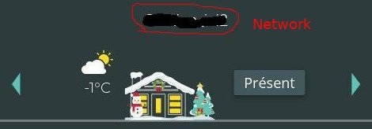
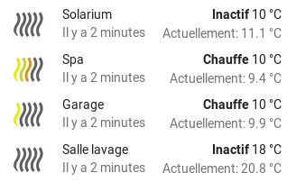

## Home Assistant Neviweb130 Custom Components

Custom components to support [Neviweb](https://neviweb.com/) devices in [Home Assistant](http://www.home-assistant.io). 
Neviweb is a platform created by Sinopé Technologies to interact with their smart devices like thermostats, light 
switches/dimmers , load controllers, plug and water leak detector etc. 

Neviweb130 will manage the Zigbee devices connected to Neviweb via the GT130 gateway and the new Wi-Fi devices. It is 
presently almost up to date with Neviweb but some information are still missing from Sinopé. As new devices are launched 
by Sinopé, they are added to this custom-component. If you have a device that is not supported yet, please open an issue 
and I'll add it quickly.

## Big changes for valve devices

Since version 2.6.2, valves devices are supported as new HA valve entities. They are no longer supported as switch. This 
will cause all your switch.neviweb130_switch_sedna_valve to be replaced by valve.neviweb130_valve_sedna_valve entities. 
You will need to revise your automation and cards to retrieve your valve entities.

## Supported Devices
Here is a list of currently supported devices. Basically, it's everything that can be added in Neviweb.
- Zigbee thermostats:
  - Sinopé TH1123ZB 3000W Line voltage thermostat
  - Sinopé TH1124ZB 4000W Line voltage thermostat
  - Sinopé TH1123ZB 3000W Thermostat for public areas
  - Sinopé TH1124ZB 4000W Thermostat for public areas
  - Sinopé TH1123ZB-G2 3000W Thermostat second generation
  - Sinopé TH1124ZB-G2 4000W Thermostat second generation
  - Sinopé TH1134ZB-HC for control of heating/cooling interlocking
  - Sinopé TH1300ZB 3600W Floor heating thermostat
  - Sinopé TH1320ZB-04 Floor heating thermostat
  - Sinopé TH1400ZB Low voltage thermostat
  - Sinopé TH1500ZB 3600W double pole thermostat
  - Sinopé TH1134ZB-HC for heating/cooling interlocking
  - Nordik TH1420ZB-01 Nordik low voltage radiant hydroponic floor thermostat
  - Ouellet OTH3600-GA-ZB Ouellet Floor thermostat
  - Ouellet OTH4000-ZB Ouellet 4000W Line voltage thermostat
- Wi-Fi thermostats (no need for GT130):
  - Sinopé TH1124WF Wi-Fi 4000W Line voltage thermostat
  - Sinopé TH1123WF Wi-Fi 3000W Line voltage thermostat
  - Sinopé TH1133WF Wi-Fi 3000W Line voltage thermostat lite
  - Sinopé TH1133CR Sinopé Evo 3000w Line voltage thermostat lite
  - Sinopé TH1134WF Wi-Fi 4000W Line voltage thermostat lite
  - Sinopé TH1134CR Sinopé Evo 4000w Line voltage thermostat lite
  - Sinopé TH1143WF Wi-Fi 3000W two wires connection, color screen
  - Sinopé TH1144WF WI-Fi 4000W two wires connection, color screen
  - Sinopé TH1300WF Wi-Fi 3600W floor thermostat
  - Sinopé TH1310WF Wi-Fi 3600W floor thermostat
  - Sinopé TH1325WF Wi-Fi 3600W floor thermostat
  - Sinopé TH1400WF Wi-Fi low voltage thermostat
  - Sinopé TH1500WF Wi-Fi 3600W double pole thermostat
  - Sinopé TH6500WF Wi-Fi heat/cool
  - Sinopé TH6510WF Wi-Fi heat/cool
  - Sinopé TH6250WF Wi-Fi heat/cool
  - Sinopé TH6250WF_PRO Wi-Fi heat/cool
  - Flextherm concerto connect FLP55 floor thermostat (sku FLP55 do not provide energy stats in Neviweb)
  - Flextherm True Comfort floor thermostat
  - SRM40 floor thermostat
- Heatpump controller:
  - Sinopé HP6000ZB-GE for Ouellet heat pump with Gree connector
  - Sinopé HP6000ZB-MA for Ouellet Convectair heat pump with Midea connector
  - Sinopé PH6000ZB-HS for Hisense, Haxxair and Zephyr heat pump
- Wi-Fi Heatpump controller:
  - Sinopé HP6000ZB-MA for Ouellet Convectair heat pump with Midea connector
  - Sinopé HP6000ZB-GE for Ouellet heat pump with Gree connector
- Zigbee lighting:
  - Sinopé SW2500ZB Light switch
  - Sinopé SW2500ZB-G2 Light switch
  - Sinopé DM2500ZB Dimmer
  - Sinopé DM2500ZB-G2 Dimmer
  - Sinopé DM2550ZB Dimmer
  - Sinopé DM2550ZB-G2 Dimmer
- Zigbee specialized control:
  - Sinopé RM3250ZB Load controller 50A
  - Sinopé RM3500ZB Calypso load controller 20,8A for water heater
  - Sinopé SP2610ZB in-wall outlet
  - Sinopé SP2600ZB smart portable plug
  - Sinopé MC3100ZB Sedna valve multi-controller for alarm system
- Wi-Fi specialized control:
  - Sinopé RM3500WF Load controller for water heater
  - Sinopé RM3510WF Load controller for water heater
  - Sinopé RM3250WF load controller 50A, Wi-Fi
- Water leak detector and valves:
  - Sinopé VA4201WZ, VA4221WZ, sedna valve 1 inch
  - Sinopé VA4200WZ, VA4220WZ, sedna valve 3/4 inch Wi-Fi
  - Sinopé VA4200ZB, sedna valve 3/4 inch Zigbee
  - Sinopé VA4220WZ, sedna 2e gen 3/4 inch
  - Sinopé VA4220WF, sedna 2e gen 3/4 inch, Wi-Fi
  - Sinopé VA4220ZB, sedna 2e gen 3/4 inch, Zigbee
  - Sinopé VA4221WZ, sedna 2e gen 1 inch
  - Sinopé VA4221WF, sedna 2e gen 1 inch, Wi-Fi
  - Sinopé VA4221ZB, sedna 2e gen 1 inch, Zigbee
  - Sinopé WL4200,   water leak detector
  - Sinopé WL4200S,  water leak detector with sensor
  - Sinopé WL4200C,  perimeter cable water leak detector
  - Sinopé WL4200ZB, water leak detector
  - Sinopé WL4210,   water leak detector
  - Sinopé WL4210S,  water leak detector with sensor
  - Sinopé WL4210C,  perimeter cable water leak detector
  - Sinopé WL4210ZB, water leak detector
  - Sinopé WL4200ZB, connected to Sedna valve
  - Sinopé ACT4220WF-M, VA4220WF-M, sedna multi-residential master valve 2e gen 3/4 inch, Wi-Fi
  - Sinopé ACT4220ZB-M, VA4220ZB-M, sedna multi-residential slave valve 2e gen 3/4 inch, Zigbee
  - Sinopé ACT4221WF-M, VA4221WF-M, sedna multi-residential master valve 2e gen. 1 inch, Wi-Fi
  - Sinopé ACT4221ZB-M, VA4221ZB-M, sedna multi-residential slave valve 2e gen. 1 inch, Zigbee
- Flow sensor: (supported as attribute for the 2e gen Sedna valves)
  - Sinopé FS4220, 3/4 inch flow sensor
  - Sinopé FS4221, 1 inch flow sensor
- Tank level monitor:
  - Sinopé LM4110-ZB, Propane tank level monitor
  - Sinopé LM4110-LTE, Propane tank level monitor LTE
- Gateway:
  - GT130
  - GT4220WF-M, mesh gateway
- Power supply:
  - Sinopé ACUPS-01, battery backup for Sedna valve, GT130 or GT125

## Prerequisite
You need to connect your devices to a GT130 web gateway and add them in your Neviweb portal before being able to 
interact with them within Home Assistant. Please refer to the instructions manual of your device or visit 
[Neviweb support](https://www.sinopetech.com/blog/support-cat/plateforme-nevi-web/).

For Wi-Fi thermostats you need to connect your devices to Neviweb and add them in the same network then the GT130 Zigbee 
devices.

There are two custom component giving you the choice to manage your devices via the neviweb portal or directly via local 
Zigbee gateway:
- [Neviweb130](https://github.com/claudegel/sinope-130) custom component to manage your devices via neviweb portal
- Buy a Zigbee gateway like Dresden ConBee II usb dongle and manage directly your Zigbee device via ZHA component. 
  I'm adding support for Sinopé Zigbee in zha-device-handlers. You can test new Sinopé devices quirks in 
  [sinope-zha](https://github.com/claudegel/sinope-zha) where I put all new quirks before they are merged into 
  zha-device-handlers.

You need to install only one of them but both can be used at the same time on HA. Zigbee devices managed directly via 
ConBee II must be removed from Neviweb as they cannot be on two networks at the same time.

## Neviweb custom component to manage your device via Neviweb portal:
## Installation
There are two methods to install this custom component:
- via HACS component:
  - This repository is compatible with the Home Assistant Community Store 
    ([HACS](https://community.home-assistant.io/t/custom-component-hacs/121727)).
  - After installing HACS, install 'sinope-130' from the store, and use the configuration.yaml example below.
- Manually via direct download:
  - Download the zip file of this repository using the top right, green download button.
  - Extract the zip file on your computer, then copy the entire `custom_components` folder inside your Home Assistant 
    `config` directory (where you can find your `configuration.yaml` file).
  - Your config directory should look like this:

    ```
    config/
      configuration.yaml
      custom_components/
        neviweb130/
          __init__.py
          climate.py
          const.py
          helpers.py
          light.py
          manifest.json
          schema.py
          sensor.py
          services.yaml
          switch.py 
          valve.py
    ```
## Configuration

To enable Neviweb130 management in your installation, add the following to your `configuration.yaml` file, then restart 
Home Assistant.

```yaml
# Example configuration.yaml entry
neviweb130:
  username: '«your Neviweb username»'
  password: '«your Neviweb password»'
  network: '«your gt130 location name in Neviweb»' (gt130 emplacement dans Neviweb)
  network2: '«your second location name in Neviweb»' (2e emplacement)
  network3: '«your third location name in Neviweb»' (3e emplacement)
  scan_interval: 360
  homekit_mode: False
  ignore_miwi: False
  stat_interval: 1800
  notify: "both"
```
Networks names are the names found on top of first page after logging into Neviweb. If you have more then one network, 
just click on icon on top to find all networks names. Select the one used for GT130 or Wi-Fi devices. Both devices types 
must be on same network to work in neviweb130. If you have two networks for two GT130 or two Wi-Fi groups then you can 
add network2 parameter in your configuration.yaml. See below. You can't mix miwi devices and Zigbee/Wi-Fi devices on the 
same network. For miwi devices install [Neviweb](https://github.com/claudegel/sinope-1) 
custom_component which can run along with this custom_component in HA.



**Configuration options:**  

| key               | required | default                                                                                                            | description                                                                                                                                                                                                                  |
|-------------------|----------|--------------------------------------------------------------------------------------------------------------------|------------------------------------------------------------------------------------------------------------------------------------------------------------------------------------------------------------------------------|
| **username**      | yes      |                                                                                                                    | Your email address used to log in Neviweb.                                                                                                                                                                                   |
| **password**      | yes      |                                                                                                                    | Your Neviweb password.                                                                                                                                                                                                       |
| **network**       | no       | if not specified, 1st location found is used. Write the name of the GT130 location in Neviweb you want to control. | Network name is the location name in Neviweb written on top center of first page, where your Wi-Fi or Zigbee devices are registered.                                                                                         |
| **network2**      | no       | 2nd location found                                                                                                 | The name of the second location you want to control (Zigbee and/or Wi-Fi only). Don't add it if you have only one network.                                                                                                   |
| **network3**      | no       | 3rd location found                                                                                                 | The name of the third location you want to control (Zigbee and/or Wi-Fi only). Don't add it if you have only one network.                                                                                                    |
| **scan_interval** | no       | 540                                                                                                                | The number of seconds between each access to Neviweb to update device state. Sinopé asked for a minimum of 5 minutes between polling now so you can reduce scan_interval to 300. Don't go over 600, the session will expire. |
| **homekit_mode**  | no       | False                                                                                                              | Add support for Homekit specific values. Not needed if you don't use homekit.                                                                                                                                                |
| **ignore_miwi**   | no       | False                                                                                                              | Ignore miwi devices if present in same location then Zigbee and/or Wi-Fi devices. Warm if we set wrong Neviweb location.                                                                                                     |
| **stat_interval** | no       | 1800                                                                                                               | The number of seconds between each access to Neviweb for energy statistic update. Scan will start after 5 minutes from HA startup and will be updated at every 300 to 1800 seconds.                                          |
| **notify**        | no       | both                                                                                                               | The method to send notification in case of device error. value option are nothing, logging, notification, both.                                                                                                              |

If you have a GT125 also connected to Neviweb the network parameter is mandatory, or it is possible that during the 
setup, the GT125 network will be picked up accidentally. If you have only two GT130/Wi-Fi network, you can omit there 
names as during setup, the first two network found will be picked up automatically. If you prefer to add networks names 
make sure that they are written «exactly» as in Neviweb. (first letter capitalized or not). Avoid also accented letters 
as Home Assistant will remove them and location name won't match preventing custom_component loading.

## Sedna valve
For Sedna valves there are two ways to connect it to Neviweb:
- Via Wi-Fi direct connection. This way leak sensor are connected directly to the Sedna valve which will close if leak 
  is detected.
- via GT130 in Zigbee mode. This  way leak sensor are also connected to the GT130 but on leak detection nothing is 
  passed to the valve. You'll need to set some automation rule in Neviweb or HA, to have the Sedna valve close if leak 
- is detected by sensor.

Both modes are supported by this custom component. 

## Gateway GT130
It is now possible to know if your GT130 is still online of offline with Neviweb via the gateway_status attribute. The 
GT130 is detected as sensor.neviweb130_sensor_gt130

## Running more than one instance of neviweb130 to manage different Neviweb connections.
It is possible to run two instance of neviweb130, but you need to use two different username (email) and password to 
connect to Neviweb.
Steps to achieve this:

- Create another directory in config/custom_components like neviweb131.
- Copy all files from directory neviweb130 to new directory neviweb131.
- In neviweb131, edit file manifest.json to change the line #2, "domain": "neviweb130",
and change it to the same name as the directory you just create. "domain": "neviweb131",
- Add a second configuration in configuration.yaml like this:
```yaml
# Example configuration.yaml entry for a second neviweb130 instance named neviweb131.
neviweb131:
  username: 'your Neviweb username for second connection'
  password: 'your Neviweb password for second connection'
  network: 'your gt130 location name in second Neviweb' (gt130 emplacement dans Neviweb)
  network2: 'your second location name in second Neviweb' (2e emplacement)
  network3: 'your third location name in second Neviweb' (3e emplacement)
  scan_interval: 360
  homekit_mode: False
  ignore_miwi: False
  stat_interval: 1800
  notify: "both"
```
- Restart Home Assistant.

All devices on this second instance will have a name like climate.neviweb131_climate_office_thermostat.
Don't be too aggressive on polling (scan_interval) or Neviweb will disconnect you as both instance polling
come from your same IP.

## Custom services
Automations require services to be able to send command. Ex. light.turn_on. For the Sinopé devices connected via 
neviweb130, it is possible to use custom services to send specific information to devices or to change some devices 
parameters. Those custom services can be accessed via development tool/services or can be used in automation:
- neviweb130.set_second_display, allow to change setting of the thermostats second display from setpoint temperature to 
  outdoor temperature. This needs to be sent only once to each device.
- neviweb130.set_climate_keypad_lock, allow to lock the keypad of the climate device.
- neviweb130.set_light_keypad_lock, allow to lock the keypad of the light device.
- neviweb130.set_switch_keypad_lock, allow to lock the keypad of the switch device.
- neviweb130.set_light_timer, this is used to set a timer in seconds (0 to 10800) to the light devices to turn_off after 
  that delay.
- neviweb130.set_switch_timer, this is used to set a timer in seconds (0 to 10800) to the switch devices and multi 
  controller device to turn_off after that delay.
- neviweb130.set_switch_timer2, this is used to set the timer2 in seconds (0 to 10800) to the switch multi controller 
  device to turn_off after that delay.
- neviweb130.set_led_indicator, this allows to change led indicator color and intensity on light devices for «on» and 
  «off» state. you can send any color in the RGB list via the three color parameters red, green and blue, and you can 
  set intensity of the LED indicator.
- neviweb130.set_time_format to display time in 12h or 24h on thermostats.
- neviweb130.set_temperature_format to display temperature in Celsius or Fahrenheit format on thermostats.
- neviweb130.set_backlight to set backlight intensity in state «on» or «off» for thermostats.
- neviweb130.set_wattage to set wattageOverload for light devices.
- neviweb130.set_auxiliary_load to set status and load of the auxiliary heating.
- neviweb130.set_setpoint_min to set minimum setpoint temperature for thermostats.
- neviweb130.set_setpoint_max to set maximum setpoint temperature for thermostats.
- neviweb130.set_cool_setpoint_min to set minimum cooling setpoint for TH1134ZB-HC.
- neviweb130.set_cool_setpoint_max to set maximum cooling setpoint for TH1134ZB-HC.
- neviweb130.set_floor_limit_low to set minimum setpoint temperature for floor thermostats. (5 to 34°C), (0 = off)
- neviweb130.set_floor_limit_high to set maximum setpoint temperature for floor thermostats. (7 to 36°C), (0 = off)
- neviweb130.set_sensor_alert to set all alert for water leak sensor, temperature, battery, leak, status and set action 
  on valve.
- neviweb130.set_valve_alert to set low battery alert status.
- neviweb130.set_valve_temp_alert to set low temperature alert on sedna valve.
- neviweb130.set_early_start to set early heating on/off for Wi-Fi thermostats.
- neviweb130.set_air_floor_mode to switch between floor or ambient temperature sensor to control room temperature.
- neviweb130.set_floor_air_limit to set floor thermostat max air limit temperature.
- neviweb130.set_phase_control to set phase control mode for DM2550ZB dimmer (reverse or forward).
- neviweb130.set_hvac_dr_options to set or reset DR period option in Neviweb for thermostats.
- neviweb130.set_hvac_dr_setpoint to adjust thermostat setpoint reduction during DR period, 100 to -100 (°C*10). 0 will 
  just make the small icon to flash.
- neviweb130.set_load_dr_options to set or reset DR period options in Neviweb for load controller.
- neviweb130.set_cycle_output to set main cycle length of low voltage thermostat in minutes.
- neviweb130.set_aux_cycle_output to set auxiliary cycle length of low voltage thermostats in minutes.
- neviweb130.set_control_onoff change status of output 1 and 2 on alarm multi-controller for sedna valve.
- neviweb130.set_battery_type set battery type, alkaline or lithium, for the water leak sensor.
- neviweb130.set_tank_size to set the water heater tank capacity for Calypso RM3500ZB.
- neviweb130.set_low_temp_protection to activate or not the water heater protection for water temperature. Below 45°C 
  heating is auto restarted.
- neviweb130.set_controlled_device to change the name of the device controlled by the RM3250ZB load controller.
- neviweb130.set_flow_meter_model to change the flow meter model connected to sedna valve 2e gen and start/stop leak 
  protection from flow meter.
- neviweb130.set_flow_meter_delay to set the leak delay before the valve close if a leak is detected by the flow meter. 
- neviweb130.set_flow_meter_options to set the flow meter action: close the valve (yes/no) and to send alert message 
  (yes/no), or just do nothing.
- neviweb130.set_tank_type to set tank type for LM4110-ZB, propane or oil.
- neviweb130.set_gauge_type to set gauge type for LM4110-ZB on propane tank, model 5-95 or 10-80.
- neviweb130.set_low_fuel_alert to set low fuel level limit for propane tank, 0 (off), 10, 20 or 30%.
- neviweb130.set_tank_height to set fuel tank height for LM4110-ZB sensor, 0 (off), 23, 24, 35, 38, 47, 48, 50.
- neviweb130.set_fuel_alert to set fuel alert, on/off for LM4110-ZB.
- neviweb130.set_power_supply to set power source for Sedna valve between battery, acups-01 or both.
- neviweb130.set_battery_alert to set battery alert on/off for LM4110-ZB.
- neviweb130.set_input_output_names to set name for input 1 and 2 and output 1 and 2 of MC3100ZB device.
- neviweb130.set_activation to activate or block neviweb polling for a device.
- neviweb130.set_sensor_type to set sensor value 10k or 12k.
- neviweb130.set_remaining_time to set value for coldLoadPickupRemainingTime attribute.
- neviweb130.set_on_off_input_delay to set the «on» or «off» delay in seconds for input 1 and 2 of MC3100ZB.
- neviweb130.set_em_heat to turn on/off aux heat for floor and low voltage thermostats. This is a replacement of 
  turn_aux_heat_on or off that was deprecated by HA.
- neviweb130.set_display_config to set on/off display on heatpump.
- neviweb130.set_sound_config to set on/off sound on heatpump.
- neviweb130.set_heat_pump_operation_limit to set minimum operation temperature for heatpump.
- neviweb130.set_heat_lockout_temperature to set maximum outside temperature limit to allow heating device operation.
- neviweb130.set_cool_lockout_temperature to set minimum outside temperature limit to allow cooling device operation.
- neviweb130.set_hc_second_display to set second display of TH1134ZB-HC thermostat.
- neviweb130.set_language to set display language on TH1134ZB-HC thermostats.
- neviweb130.set_aux_heat_min_time_on, to set auxiliary heating minimum time on.
- neviweb130.set_cool_min_time_on, to set cooling minimum time on.
- neviweb130.set_cool_min_time_off, to set cooling minimum time off.
- neviweb130.set_neviweb_status, to set global Neviweb status, home / away.
- neviweb130.set_refuel_alert, to get an alert when the propane tank is refueled,
- neviweb130.set_humidifier_type, to set the type of humidifier device connected to TH6500WF or TH6250WF.
- neviweb130.set_schedule_mode, to set the schedule mode, manual or auto for TH6500WF or TH6250WF.
- neviweb130.set_flow_alarm_disable_timer, to disable abnormal fow alarm for a period from 1 sec. to 24 hrs.
- neviweb130.set_heatcool_setpoint_delta, to set a temperature delta between heating setpoint and cooling setpoint from 
  1 to 5°C in auto mode for TH6xxxWF.
- neviweb130,set_fan_filter_reminder, to set the delay between each fan filter cleaning from 1 to 12 month, for 
  TH6xxxWF.
- neviweb130.set_temperature_offset, to adjust temperature sensor from -2 to 2°C with 0.5°C increment, for TH6xxxWF.
- neviweb130.set_aux_heating_source, to select which type of auxiliary heating source is in use for TH6xxxWF.
- neviweb130.set_fan_speed, to set fan speed, on or auto for TH6xxxWF.

## Logging for debugging
As the file home-assistant.log is no longer available, we have added a new logger that write all logging data about neviwen130 
to a file neviweb130_log.txt in your config file. This file is overwritten each time Ha is restarted. The file is also rotated 
each time it reach 2 meg in size.

To help debugging add snippet of this file to any issue you may have.

## Catch Éco Sinopé signal for peak period
If you have at least on thermostat or one load controller registered with Éco-Sinopé program, it is now possible to 
catch when Neviweb send the signal for pre-heating start period for thermostats or turn_off signal for the load 
controller. Seven attributes have been added for thermostats and three for load controller to know that peak period is 
coming and how it is managed:

- For thermostats:
  - **eco_status**: set to «off» during normal operation, turn «on» during peak period at the beginning of the 
    pre-heating period. this is the attribute to follow to detect a peak start.
  - **eco_setpoint**: set to «off» during normal operation, turn «on» during peak period if device is managed by 
    Eco-Sinopé.
  - **eco_optout**: set to «off» during normal operation during peak period, turn «on» if somebody change the setpoint 
    during peak period.
  - **eco_power_relative**: set to «off» during normal operation, used to set a minimum temperature compared to setpoint 
    where the thermostat will turn on automatically for frost protection.
  - **eco_power_absolute**: set to «off» during normal operation, used to limit the pi_heating_demand level between 1 to 
    100% during peak period.
  - **eco_setpoint_status**: set to «off» during normal operation, turn «on» if device setpoint is changed by 
    Eco-Sinopé.
  - **eco_setpoint_delta**: set to 0 during normal operation, changed to values between -10 and +10 during peak period. 
    For pre-heating the value is positive and for peak period it is a negative value. This is a delta applied to regular 
    setpoint. -10 = setpoint reduced by 10°C. +2 = setpoint increased by 2°C.

- For load controller:
  - **eco_status**: set to «off» during normal operation, turn «on» during peak period at the beginning of the 
    pre-heating period. this is the attribute to follow to detect a peak start.
  - **eco_onoff**: set to «off» during normal operation, turn «on» during peak period if device is managed by 
    Eco-Sinopé. The device is turned off during peak period. Nothing is done during pre-heating period.
  - **eco_optout**: set to «off» during normal operation during peak period, turn «on» if somebody turn on the device 
    during peak period.

- For Multi-controller MC3100ZB:
  - **eco_status**: set to «off» during normal operation, turn «on» during peak period at the beginning of the 
    pre-heating period. this is the attribute to follow to detect a peak start.
  - **eco_setpoint**: set to «off» during normal operation, no change during peak period if device is managed by 
    Eco-Sinopé.
  - **eco_optout**: set to «off» during normal operation, during peak period, turn «on» if somebody change the onoff 
    value during peak period.
  - **eco_power_relative**: set to «off» during normal operation, used to set a minimum temperature compared to room 
    temperature value where the MC3100ZB will turn on automatically for frost protection.
  - **eco_power_absolute**: set to «off» during normal operation, usage unknown.

It is then possible to make an automation to set all HA devices ready for peak period by following the eco_status 
attribute change from «off» to «on».

## Statistic for energy
Seven attributes are added to track energy usage for devices:
- total_kwh_count: total count of energy usage to date.
- hourly_kwh_count:  total count for hourly usage for current day.
- daily_kwh_count: total count of water liters daily usage for current month.
- monthly_kwh_count: total count of water liters monthly usage for current year.
- hourly_kwh: kwh used for last hour.
- daily_kwh: kwh used for last day.
- monthly_kwh: kwh used for last month.

They are polled from Neviweb every 30 minutes. The first polling start 5 minutes after HA restart. Neviweb have a two 
hours delay to publish his data.

### Track energy consumption in HA Energy dashboard
When energy attributes are available, it is possible to track energy consumption of individual devices in Home Assistant 
energy dashboard by creating a [Template sensor](https://www.home-assistant.io/integrations/template/) in configuration.yaml:
```yaml
template:
  - sensor:
      - name: "Basement energy usage"
        unique_id: sensor.basement_energy_usage
        unit_of_measurement: "kWh"
        device_class: energy
        state_class: total_increasing
        state: >-
          {{ state_attr("climate.neviweb130_th1124zb_basement","hourly_kwh_count") }}
```
or:
```yaml
template:
  - sensor:
      - name: "Basement energy usage"
        unique_id: sensor.basement_energy_usage
        unit_of_measurement: "kWh"
        device_class: energy
        state_class: total
        state: >-
          {{ state_attr("climate.neviweb130_th1124zb_basement","hourly_kwh") }}
```

## Statistic for Sedna flow sensor
Seven attributes are added to track water usage for Sedna valve. They are shown as m³ (cubic meeter) which is what 
energy module is looking for:
- total_flow_count: total count of water liters usage to date.
- hourly_flow_count:  total count of hourly water liters usage for current day.
- daily_flow_count: total count of daily water liters usage for current month.
- monthly_flow_count: total count of monthly water liters usage for current year.
- hourly_flow: water liters used for last hour.
- daily_flow: water liters used for last day.
- monthly_flow: water liters used for last month.

They are polled from Neviweb every 30 minutes. The first polling start 5 minutes after HA restart. Neviweb have a two 
hours delay to publish his data.

### Track water consumption in HA Energy dashboard
When flow attributes are available, it is possible to track water consumption of sedna valve in Home Assistant energy 
dashboard by creating a [Template sensor](https://www.home-assistant.io/integrations/template/) in configuration.yaml:
```yaml
template:
  - sensor:
      - name: "Sedna Water Flow"
        unique_id: sensor.sedna_water_flow
        unit_of_measurement: "m³"
        device_class: water
        state_class: total_increasing
        state: >-
          {{ state_attr("valve.neviweb130_valve_water_valve","hourly_flow_count") }}
```
or:
```yaml
template:
  - sensor:
      - name: "Sedna Water Flow"
        unique_id: sensor.sedna_water_flow
        unit_of_measurement: "m³"
        device_class: water
        state_class: total
        state: >-
          {{ state_attr("valve.neviweb130_valve_water_valve","hourly_flow") }}
```

## Troubleshooting
if you see your device in the log, but it does not appear in entity list you need to add the device model number in the 
code. Or you can send the model number to me, so I can add it in the code.

In the log look for lines:
```
[custom_components.neviweb130] Received gateway data: [{'id': 100225, 'identifier': '500b91400001f750', 'name': 'Chargeur auto', 'family': '2506',...
[custom_components.neviweb130] Received signature data: {'signature': {'model': 2506, 'modelCfg': 0, 'softBuildCfg': 0, 'softVersion': {'minor': 9, 'middle': 2, 'major': 1}, 'hardRev': 2, 'protocol': 'sinopcom'}}
```
'family': '2506' and 'model': 2506 is what you need to find the model number of your device. It should be added in 
climate.py, light.py, switch.py or sensor.py near line 132 to 136 (climate.py) depending on device type. Then restart HA 
and your device will be listed in entity list.

If you get a stack trace related to a Neviweb130 component in your `home-assistant.log` file, you can file an issue in 
this repository.

You can also post in one of those threads to get help:
- https://community.home-assistant.io/t/sinope-line-voltage-thermostats/17157
- https://community.home-assistant.io/t/adding-support-for-sinope-light-switch-and-dimmer/38835

### Turning on Neviweb130 debug messages in `neviweb130_log.txt` file

To have a maximum of information to help you, please provide a snippet of your `home-assistant.log` file. I've added 
some debug log messages that could help diagnose the problem.

Add those lines to your `configuration.yaml` file
   ```yaml
   logger:
     default: warning
     logs:
       custom_components.neviweb130: debug
       homeassistant.service: debug
       homeassistant.config_entries: debug
   ```
This will set default log level to warning for all your components, except for Neviweb which will display more detailed 
messages.

### Error messages received from Neviweb
In you log you can get those messages from Neviweb:
- ACCDAYREQMAX: Maximum daily request reached... Reduce polling frequency.
- ACCSESSEXC: To many open session at the same time. This is common if you restart Home Assistant many times and/or you 
  also have an open session on Neviweb.
- DVCACTNSPTD: Device action not supported. Service call is not supported for that specific device.
- DVCATTRNSPTD: Device attribute not supported, The device you have installed have and older firmware and do not support 
  some attributes. Wait for firmware update in Neviweb and the error should disappear or file an issue so we can put an 
  exception in the code.
- DVCBUSY: Neviweb is performing an update and devices are not available. Try later.
- DVCCOMMTO: Device Communication Timeout: device do not respond fast enough, or you are polling that device too 
  frequently.
- DVCNOTSYNC: Device is not in sync with Neviweb. Check your network, router and/or Wi-Fi gateway.
- DVCUNVLB: Device unavailable. Neviweb is unable to connect with specific device, mostly Wi-Fi devices. 
- MAINTENANCE: Neviweb access temporary blocked for maintenance... Retry later.
- SVCERR: Service error. Service unavailable. Try later.
- SVCINVREQ: Invalid request sent to Neviweb, service do not exist or malformed request.
- USRBADLOGIN: your login and/or password provided in configuration for Neviweb is no good.
- USRSESSEXP: User session expired. Reduce your scan_interval below 6 minutes or your session will be terminated.
- VALINVLD: Invalid value sent to Neviweb.
- ReadTimeout: Request was sent to the device but no answer came back. Network problem.
- TimeoutError: Timeout error detected... Retry later.

## Customization
Install  [Custom-Ui](https://github.com/Mariusthvdb/custom-ui) custom_component via HACS and add the following in your 
code:

Icons for heat level: create folder www in the root folder .homeassistant/www
copy the six icons there. You can find them under local/www
feel free to improve my icons and let me know. 


For each thermostat add this code in `customize.yaml`
```yaml
climate.neviweb_climate_thermostat_name:
  templates:
    entity_picture: >
      if (attributes.heat_level < 1) return '/local/heat-0.png';
      if (attributes.heat_level < 21) return '/local/heat-1.png';
      if (attributes.heat_level < 41) return '/local/heat-2.png';
      if (attributes.heat_level < 61) return '/local/heat-3.png';
      if (attributes.heat_level < 81) return '/local/heat-4.png';
      return '/local/heat-5.png';
 ```  
 In `configuration.yaml` add this
```yaml
homeassistant:
  customize: !include customize.yaml
``` 
## Customization for leak sensor

Same as above. 
-Create a sensor:
```yaml
battery_spa:
        friendly_name: "Batterie spa"
        unit_of_measurement: "%"
        value_template: "{{ state_attr('sensor.neviweb130_sensor_spa', 'Battery_level') }}"
```        
-For each leak detector add this to your `customize.yaml` file
```yaml
sensor.battery_spa:
  templates:
    entity_picture: >
      if (entity.state < 10) return '/local/battery-1.png';
      if (entity.state < 30) return '/local/battery-2.png';
      if (entity.state < 50) return '/local/battery-3.png';
      if (entity.state < 70) return '/local/battery-4.png';
      return '/local/battery-5.png';
sensor.neviweb130_sensor_spa:    
      if (attributes.Leak_status == "ok") return ''/local/drop.png'';
      return ''/local/leak.png'';'
```
Icons are available from www directory. Copy them in config/www

# Device hard reset:
- Thermostats:
    - Raise the temperature until the display change.
    - Push the two button until CLR appear on the screen.
    - Push once the upper button to get YES on the display.
    - Push both button simultaneously and release immediately. DONE should appear on the screen.
    - The thermostat will restart with factory setup

- thermostats G2:
    - Raise the temperature until the display change.
    - Push and hold the two button until RST appear on the screen.
    - Wait until device restart.

## TO DO
- when this component will be stable. Merge it with The Neviweb component to poll all devices from only one component.

## Buy me a coffee
If you want to make donation as appreciation of my work, you can do so via PayPal. Thank you!
[](https://www.paypal.me/phytoressources/)

