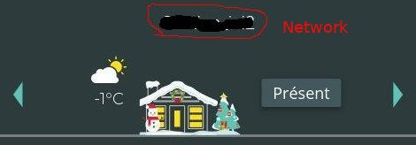
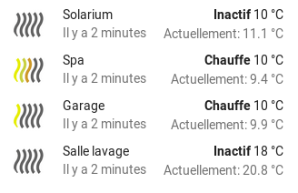
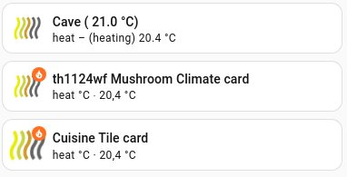
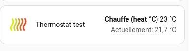

## Home Assistant Neviweb130 Custom Components
[🇬🇧 English version](../README.md)
> 💛 **Vous aimez cette integration?**  
> Si vous voulez supporter son développement, vous pouvez contribuer ici:
> [](https://www.paypal.me/phytoressources/)

Composants personnalisés pour prendre en charge les appareils [Neviweb](https://neviweb.com/) dans [Home Assistant](http://www.home-assistant.io) (HA). 
Neviweb est une plateforme créée par Sinopé Technologies pour interagir avec leurs appareils intelligents comme les thermostats, l'éclairage
interrupteurs/gradateurs, contrôleurs de charge, prise, vannes et détecteur de fuite d'eau, etc.

Neviweb130 (HACS: Sinope Neviweb130) gérera les appareils Zigbee connectés à Neviweb via la passerelle GT130 et les nouveaux appareils Wi-Fi connectés 
directement sur Neviweb. Il est actuellement pratiquement à jour avec Neviweb mais certaines informations manquent encore chez Sinopé. 
Au fur et à mesure que de nouveaux appareils sont lancés par Sinopé, ils sont ajoutés à ce composant personnalisé. Si vous possédez 
un appareil qui n'est pas pris en charge, veuillez ouvrir une issue et je l'ajouterai rapidement.

Signaler un problème ou proposer une amélioration : [Créer une issue](https://github.com/claudegel/sinope-130/issues/new/choose)

## Table des matières

- [Annonce](#annonce)
- [Appareils supportées](#appareils-pris-en-charge)
- [Prérequis](#prerequis)
- [Installation](#installation)
- [Configuration](#configuration-1er-generation)
- [Multi_comptes](#configuration-multi-comptes)
- [Valve Sedna](#valve-sedna)
- [GT130](#passerelle-gt130)
- [Mise à jour](#systeme-de-mise-a-jour)
- [Compteur de requêtes](#compteur-de-requetes-quotidiennes-neviweb)
- [Multi instance (obsolète)](#execution-de-plusieurs-instances-de-neviweb130-pour-gerer-differents-comptes-neviweb)
- [Services / Actions](#services-personnalises-actions)
- [Journalisation](#journalisation-pour-le-debogage)
- [Éco-Sinopé](#capter-le-signal-eco-sinope-de-neviweb-pour-les-periodes-de-pointe)
- [Statistiques d'énergie](#statistiques-pour-lenergie)
- [Localisation (language)](#localisation)
- [Statistiques de débit](#statistique-pour-le-capteur-de-debit-sedna)
- [Dépannage](#depannage)
- [Personnalisation](#personnalisation)
- [Réinitialisation](#reinitialisation-materielle-de-lappareil)
- [TO DO](#a-faire)

## Annonce
### Gros changements pour les valves Sedna

Depuis la version de neviweb130 2.6.2, les valves sont pris en charge en tant que nouvelles entités de valve dans HA. Ils ne sont plus pris 
en charge en tant que commutateur (switch). Ceci entraîne le remplacement de toutes vos entités `switch.neviweb130_switch_sedna_valve` par 
des entités `valve.neviweb130_valve_sedna_valve`. Vous devrez réviser vos automatismes et vos cartes pour récupérer vos entités valves.

## Appareils pris en charge
Voici une liste des appareils actuellement pris en charge. En gros, c'est tout ce qui peut être ajouté dans Neviweb.
- **thermostats Zigbee**:
  - Sinopé TH1123ZB, thermostat de ligne 3000W
  - Sinopé TH1124ZB, thermostat de ligne 4000W
  - Sinopé TH1123ZB, thermostat de ligne pour aires publiques 3000W
  - Sinopé TH1124ZB, thermostat de ligne pour aires publiques 4000W
  - Sinopé TH1123ZB-G2, thermostat deuxième génération 3000W
  - Sinopé TH1124ZB-G2, thermostat deuxième génération 4000W
  - Sinopé TH1134ZB-HC, pour le contrôle du verrouillage chauffage/refroidissement
  - Sinopé TH1300ZB, thermostat de chauffage au sol 3600W
  - Sinopé TH1320ZB-04, thermostat de chauffage au sol
  - Sinopé TH1400ZB, thermostat basse tension
  - Sinopé TH1500ZB, thermostat bipolaire 3600W
  - Nordik TH1420ZB-01, thermostat de plancher hydroponique radiant basse tension Nordik
  - Ouellet OTH3600-GA-ZB, thermostat de plancher Ouellet
  - Ouellet OTH4000-ZB, thermostat basse tension Ouellet 4000W
- **thermostats Wi-Fi** (pas besoin de GT130):
  - Sinopé TH1124WF Wi-Fi, thermostat de ligne 4000W
  - Sinopé TH1123WF Wi-Fi, thermostat de ligne 3000W
  - Sinopé TH1133WF Wi-Fi, thermostat à tension de ligne – édition Lite 3000W
  - Sinopé TH1133CR, thermostat à tension de ligne – édition Lite Sinopé Evo 3000w
  - Sinopé TH1134WF Wi-Fi, thermostat à tension de ligne – édition Lite 4000W
  - Sinopé TH1134CR, Thermostat à tension de ligne – édition Lite Sinopé Evo 4000w
  - Sinopé TH1143WF, thermostat à deux fils, écran couleur Wi-Fi 3000W
  - Sinopé TH1144WF, thermostat à deux fils, écran couleur WI-Fi 4000W
  - Sinopé TH1300WF, thermostat au sol Wi-Fi 3600W
  - Sinopé TH1310WF, thermostat au sol Wi-Fi 3600W
  - Sinopé TH1325WF, thermostat au sol Wi-Fi 3600W
  - Sinopé TH1400WF, thermostat basse tension Wi-Fi 
  - Sinopé TH1500WF, thermostat bipolaire Wi-Fi 3600W 
  - Sinopé TH6500WF, thermostat Wi-Fi chauffage/climatisation
  - Sinopé TH6510WF, thermostat Wi-Fi chauffage/climatisation
  - Sinopé TH6250WF, thermostat Wi-Fi chauffage/climatisation
  - Sinopé TH6250WF_PRO, thermostat Wi-Fi chauffage/climatisation PRO
  - Sinopé THEWF01, thermostat de ligne, édition lite Wi-Fi
  - Flextherm concerto connect FLP55 thermostat de sol (sku FLP55 ne fourni pas de statistique énergétique dans Neviweb)
  - Flextherm True Comfort, thermostat de sol
  - SRM40, thermostat de sol
- **Contrôleur de pompe à chaleur**:
  - Sinopé HP6000ZB-GE, pour les thermopompes Ouellet avec connecteur Gree
  - Sinopé HP6000ZB-MA, pour les thermopompes Ouellet, Convectair avec connecteur Midea
  - Sinopé PH6000ZB-HS, pour les thermopompes Hisense, Haxxair et Zephyr
- **Contrôleur de pompe à chaleur Wi-Fi**:
  - Sinopé HP6000WF-MA, pour les thermopompes Ouellet, Convectair avec connecteur Midea
  - Sinopé HP6000WF-GE, pour les thermopompes Ouellet avec connecteur Gree
- **éclairage Zigbee**:
  - Sinopé SW2500ZB, Interrupteur
  - Sinopé SW2500ZB-G2, Interrupteur nouvelle génération
  - Sinopé DM2500ZB, gradateur
  - Sinopé DM2500ZB-G2, gradateur nouvelle génération
  - Sinopé DM2550ZB, gradateur
  - Sinopé DM2550ZB-G2, gradateur
- **éclairage Zigbee connecté directement à la valve Sedna**:
  - Sinopé SW2500ZB-VA, Interrupteur
  - Sinopé DM2500ZB-VA, gradateur
  - Sinopé DM2550ZB-VA, gradateur
- **Contrôle spécialisé Zigbee**:
  - Sinopé RM3250ZB, Contrôleur de charge 50A
  - Sinopé RM3500ZB, Contrôleur de charge Calypso pour chauffe-eau 20,8A 
  - Sinopé SP2610ZB, prise murale
  - Sinopé SP2600ZB, prise portable intelligente
  - Sinopé MC3100ZB, multicontrôleur pour système d'alarme et valve Sedna
- **Contrôle spécialisé Zigbee connecté directement à la valve Sedna**:
  - Sinopé RM3250ZB-VA, Contrôleur de charge 50A 
  - Sinopé SP2610ZB-VA, prise murale
  - Sinopé SP2600ZB-VA, prise portable intelligente
  - Sinopé MC3100ZB-VA, multicontrôleur pour système d'alarme et valve Sedna
- **Contrôle spécialisé Wi-Fi**:
  - Sinopé RM3500WF, Contrôleur de charge pour chauffe-eau, Wi-Fi
  - Sinopé RM3510WF, Contrôleur de charge pour chauffe-eau, Wi-Fi
  - Sinopé RM3250WF, Contrôleur de charge 50A, Wi-Fi
- **Water leak detector and valves**:
  - Sinopé VA4201WZ, VA4221WZ, valve sedna 1 pouce
  - Sinopé VA4200WZ, VA4220WZ, valve sedna 3/4 pouce, Wi-Fi
  - Sinopé VA4200ZB, valve sedna 3/4 pouce Zigbee
  - Sinopé VA4220WZ, valve sedna 2e gen 3/4 pouce
  - Sinopé VA4220WF, valve sedna 2e gen 3/4 pouce, Wi-Fi
  - Sinopé VA4220ZB, valve sedna 2e gen 3/4 pouce, Zigbee
  - Sinopé VA4221WZ, valve sedna 2e gen 1 pouce
  - Sinopé VA4221WF, valve sedna 2e gen 1 pouce, Wi-Fi
  - Sinopé VA4221ZB, valve sedna 2e gen 1 pouce, Zigbee
  - Sinopé WL4200,   détecteur de fuite
  - Sinopé WL4200S,  détecteur de fuite avec sonde déportée
  - Sinopé WL4200C,  cable de périmètre détecteur de fuite
  - Sinopé WL4200ZB, détecteur de fuite
  - Sinopé WL4210,   détecteur de fuite
  - Sinopé WL4210S,  détecteur de fuite avec sonde déportée
  - Sinopé WL4210C,  cable de périmètre détecteur de fuite
  - Sinopé WL4210ZB, détecteur de fuite
  - Sinopé WL4200ZB, détecteur de fuite connecté à la valve Sedna
  - Sinopé ACT4220WF-M, VA4220WF-M, valve sedna multi-residentiel maitre valve 2e gen 3/4 pouce, Wi-Fi
  - Sinopé ACT4220ZB-M, VA4220ZB-M, valve sedna multi-residentiel secondaire valve 2e gen 3/4 pouce, Zigbee
  - Sinopé ACT4221WF-M, VA4221WF-M, valve sedna multi-residentiel maitre valve 2e gen. 1 pouce, Wi-Fi
  - Sinopé ACT4221ZB-M, VA4221ZB-M, valve sedna multi-residentiel secondaire valve 2e gen. 1 pouce, Zigbee
- **Capteur de débit**: (pris en charge comme attribut pour les valves Sedna de 2e génération)
  - Sinopé FS4220, capteur de débit 3/4 pouce
  - Sinopé FS4221, capteur de débit 1 pouce
- **Moniteur de niveau de réservoir**:
  - Sinopé LM4110-ZB, Moniteur de niveau de réservoir de propane
  - Sinopé LM4110-LTE, Moniteur de niveau de réservoir de propane LTE
- **Passerelle**:
  - GT130
  - GT4220WF-M, passerelle mesh
- **Alimentation**:
  - Sinopé ACUPS-01, batterie de secours pour valve Sedna, GT130 ou GT125
 
## Prerequis
Vous devez connecter vos appareils à une passerelle Web GT130 et les ajouter dans votre portail Neviweb avant de pouvoir 
interagir avec eux dans Home Assistant. Pour les appareils Wi-Fi vous devez les connecter directement à Neviweb. Certain 
appareils Zigbee peuvent être connectés à une valve Sedna connectée directement à Neviweb et agissant comme une passerelle.
Veuillez vous référer au manuel d'instructions de votre appareil ou visiter [Assistance Neviweb](https://support.sinopetech.com/)

Les appareils Wi-Fi peuvent être connectés au même réseau (emplacement) que les appareils GT130 Zigbee ou dans un réseau séparé.
**Neviweb130** supporte jusqu'à trois réseaux dans Neviweb.

Il existe quatre composants personnalisés vous donnant le choix de gérer vos appareils via le portail Neviweb ou directement en local. 

- Composant personnalisé [**neviweb**](https://github.com/claudegel/sinope-1) (HACS : Sinope Neviweb) permettant de gérer vos appareils via le portail Neviweb.
- Composant personnalisé [**sinope**](https://github.com/claudegel/sinope-gt125) (HACS : Sinope GT125) permettant de gérer vos appareils directement via
  votre passerelle web GT125.

**Passerelle Zigbee**:
- [**neviweb130**](https://github.com/claudegel/sinope-130) ce composant personnalisé, pour gérer vos appareils via le portail Neviweb.
- [**sinope-zha**](https://github.com/claudegel/sinope-zha) où je mets tous les gestionnaires d’adaptations Zigbee (quirks) des nouveaux
  appareils Sinopé avant qu'ils ne soient fusionnés dans les gestionnaires de périphériques ZHA. Achetez une passerelle Zigbee
  comme la clé USB **Dresden ConBee II** et gérez votre appareil Zigbee localement via le composant ZHA. J'ajoute le support des
  appareils Sinopé Zigbee dans le gestionnaire de périphériques ZHA. Vous pouvez tester les gestionnaire d’adaptations Zigbee
  Sinopé dans HA en copiant les fichiers sinope-zha directement dans votre configuration HA. ZHA les chargera à la place des
  gestionnaire d’adaptations Zigbee standard de Sinopé dans ZHA.

Vous pouvez en installer qu’un seul, mais tous peuvent être utilisés en même temps sur HA. Les appareils Zigbee gérés directement via 
ZHA doivent être supprimées de Neviweb car elles ne peuvent pas être sur deux réseaux Zigbee en même temps.

## Installation
### Composant personnalisé Neviweb130 pour gérer votre appareil via le portail Neviweb
Il existe deux méthodes pour installer ce composant personnalisé :
- **Via le composant HACS** (Home Assistant Community Store):
  - Neviweb130 est compatible avec [HACS](https://community.home-assistant.io/t/custom-component-hacs/121727).
  - Après avoir installé HACS, installez « Sinope neviweb-130 » (neviweb130) depuis le magasin et utilisez l'exemple configuration.yaml ci-dessous.
- **Manuellement via téléchargement direct**:
  - Téléchargez le fichier zip de ce référentiel en utilisant le bouton de téléchargement vert en haut à droite.
  - Extrayez le fichier zip sur votre ordinateur, puis copiez l'intégralité du dossier « custom_components » dans votre Home Assistant 
    Répertoire `config` (où vous pouvez trouver votre fichier `configuration.yaml`).
  - Votre répertoire de configuration devrait ressembler à ceci :
 
   ```
    config/
      configuration.yaml
      custom_components/
        neviweb130/
          translations/
            en.json
            fr.json
          __init__.py
          climate.py
          const.py
          helpers.py
          light.py
          manifest.json
          schema.py
          sensor.py
          services.yaml
          strings.json
          switch.py
          update.py
          valve.py
    ```
## Configuration 1er generation

Pour activer la gestion Neviweb130 dans votre installation, ajoutez ce qui suit à votre fichier `configuration.yaml`, puis redémarrez 
Home Assistant.

```yaml
# Exemple d'entrée dans configuration.yaml 
neviweb130:
  username: '«your Neviweb username»'
  password: '«your Neviweb password»'
  network: '«your gt130 location name in Neviweb»'   # gt130 emplacement dans Neviweb
  network2: '«your second location name in Neviweb»' # 2e emplacement
  network3: '«your third location name in Neviweb»'  # 3e emplacement
  scan_interval: 360
  homekit_mode: False
  ignore_miwi: False
  stat_interval: 1800
  notify: "both"
  safe_mode: "-"
```
Les noms de réseaux sont les noms trouvés en haut de la première page après la connexion à Neviweb. Si vous disposez de plusieurs réseaux, 
cliquez simplement sur l'icône en haut pour trouver tous les noms de réseaux. Sélectionnez celui utilisé pour les appareils Zigbee GT130 ou Wi-Fi.
Les deux types d'appareils peuvent être sur le même réseau pour fonctionner dans neviweb130 ou sur des réseaux séparés. Si vous disposez de deux 
réseaux pour deux GT130 ou deux groupes Wi-Fi, vous pouvez ajoutez le paramètre network2 dans votre configuration.yaml. Voir ci-dessous. 
Vous ne pouvez pas mélanger des appareils Miwi et des appareils Zigbee/Wi-Fi sur le même réseau. Pour les appareils miwi, installez [Neviweb](https://github.com/claudegel/sinope-1) 
custom_component qui peut s'exécuter avec ce custom_component dans HA.



**Options de configuration:**  

| clé               | requis | défaut                                                                                                            | description                                                                                                                                                                                                                  |
|-------------------|----------|--------------------------------------------------------------------------------------------------------------------|------------------------------------------------------------------------------------------------------------------------------------------------------------------------------------------------------------------------------|
| **username**      | Oui      |                                                                                                                    | Votre adresse email utilisée pour vous connecter à Neviweb.                                                                                                                                                                                 |
| **password**      | Oui      |                                                                                                                    | le mot de passe de votre compte Neviweb.                                                                                                                                                                                                       |
| **network**       | non      | s'il n'est pas spécifié, le 1er emplacement trouvé est utilisé. Écrivez le nom de l'emplacement GT130 dans Neviweb que vous souhaitez contrôler. | Le nom du réseau est le nom de l'emplacement dans Neviweb écrit en haut au centre de la première page, où vos appareils Wi-Fi ou Zigbee sont enregistrés.                                                                                         |
| **network2**      | non      | 2nd réseaux (emplacement) trouvé                                                                                   | Le nom du deuxième emplacement que vous souhaitez contrôler (Zigbee et/ou Wi-Fi uniquement). Ne l'ajoutez pas si vous n'avez qu'un seul réseau.                                                                                                 |
| **network3**      | non      | 3rd réseaux (emplacement) trouvé                                                                                   | Le nom du troisième emplacement que vous souhaitez contrôler (Zigbee et/ou Wi-Fi uniquement). Ne l'ajoutez pas si vous n'avez qu'un seul réseau.                                                                                             |
| **scan_interval** | non      | 540                                                                                                                | Le nombre de secondes entre chaque accès à Neviweb pour mettre à jour l'état de l'appareil. Sinopé a maintenant demandé un minimum de 5 minutes entre les interrogations afin que vous puissiez réduire scan_interval à 300. Ne dépassez pas 600, la session expirera. |
| **homekit_mode**  | non      | False                                                                                                              | Ajoutez la prise en charge des valeurs spécifiques à Homekit. Pas nécessaire si vous n'utilisez pas homekit.                                                                                                                                               |
| **ignore_miwi**   | non      | False                                                                                                              | Ignorez les appareils Miwi s'ils sont présents au même endroit que les appareils Zigbee et/ou Wi-Fi. Réchauffez-vous si nous définissons un mauvais emplacement Neviweb.                                                                                                   |
| **stat_interval** | non      | 1800                                                                                                               | Le nombre de secondes entre chaque accès à Neviweb pour la mise à jour des statistiques énergétiques. L'analyse démarrera 5 minutes après le démarrage de HA et sera mise à jour toutes les 300 à 1 800 secondes.                                          |
| **notify**        | non      | both                                                                                                               | La méthode pour envoyer une notification en cas d'erreur de périphérique. L'option de valeur est `nothing`, `logging`, `notification`, `both`.                                                                                                              |
| **safe_mode**     | non      | -                  |Le mode sans échec permet d'exécuter la mise à jour de l'appareil sans plantage en cas de paramètres incorrects ou manquants. Si un appareil reçoit une erreur DVCATTRNSPTD durant la mise aà jour, le mode sans échec s'active automatiquement pour détecter l'attribut défectueux et permettre la finalisation de la mise à jour. La valeur par défaut est « - ». Pour tester les attributs du périphérique, indiquez l'ID de l'appareil, « 12345 » comme valeur du mode sans échec. |

Si vous avez un GT125 également connecté à Neviweb, le paramètre réseau est obligatoire, ou il est possible que lors de la 
configuration, le réseau du GT125 sera capté accidentellement. Si vous ne disposez que de deux réseaux GT130/Wi-Fi, vous pouvez omettre leurs
noms comme lors de la configuration, les deux premiers réseaux trouvés seront automatiquement récupérés. Si vous préférez ajouter des noms de réseaux 
assurez-vous qu'ils soient écrits « exactement » comme dans Neviweb. (première lettre majuscule ou non). Évitez également les lettres accentuées 
car Home Assistant les supprimera et le nom de l'emplacement ne correspondra pas, empêchant le chargement de custom_component.

## Configuration multi-comptes
(nouveau dans la version 3.1.0)

Si vous devez contrôler des appareils à partir de **plusieurs comptes Neviweb** (par exemple, votre maison et celle d'un voisin), vous pouvez 
désormais utiliser le nouveau format de configuration multi-comptes. Cela élimine le besoin de dupliquer le dossier des composants personnalisés.

```yaml
# Exemple de configuration multi-comptes
neviweb130:
  accounts:
    # Compte avec plusieurs emplacements (ex: maison et chalet)
    - username: 'your_email@example.com'
      password: 'your_password'
      # l'emplacement (location) était appelé réseau dans les versions précédentes.
      #
      # Optionel: vous pouvez cibler jusqu'à trois emplacements pour ce compte:
      #   location / location2 / location3 (ou network / network2 / network3)
      #
      # Si vous omettez tous les emplacements, l'intégration utilisera automatiquement les 1 à 3 premiers emplacements
      # retourné par Neviweb pour ce compte.
    
    # Compte séparé pour les parents (en utilisant `network` - fonctionne de la même manière que `location`)
    - username: 'parents_email@example.com'
      password: 'parents_password'
      location: '5678'           # Optionel: location id/name (ou utiliser 'network')
      prefix: 'parents'          # Optionel: pseudonyme de compte (utilisé dans la dénomination des entités)
  
  # Paramètres globaux (s'appliquent à tous les comptes)
  scan_interval: 360
  homekit_mode: False
  ignore_miwi: False
  stat_interval: 1800
  notify: "both"
  safe_mode: "-"
```
Les paramètres sont en anglais. Il ne faut pas les traduire.

> **⚠️ Important : Conflits de noms d'entité dans la configuration multi-comptes**
> 
> Les noms d'entités sont construits à partir du domaine d'intégration (`neviweb130`), plus des valeurs facultatives de `prefix` et/ou `location` (emplacement).
> 
> **Problème :** Si vous omettez à la fois « préfixe » et « emplacement » pour plusieurs comptes et que les deux comptes ont des appareils avec des noms
> similaires (par exemple, les deux ont un thermostat appelé « LivingRoom »), Home Assistant peut suffixer automatiquement les identifiants d'entité :
> - `climate.neviweb130_livingroom`
> - `climate.neviweb130_livingroom_2` ← Collision gérée par HA
> 
> **Solution :** Fournissez soit un « préfixe » unique (alias de compte), soit des noms/identifiants d'« location » (emplacement) explicites, pour que les
> identifiants d'entité restent stables et lisibles :
> ```yaml
> accounts:
>   - username: 'user1@example.com'
>     password: 'pass1'
>     location: 'Home'
>     prefix: 'me'          # ← alias de compte Neviweb
>   - username: 'user2@example.com'
>     password: 'pass2'
>     location: 'Chalet'
>     prefix: 'parents'     # ← autre alias de compte Neviweb
> ```
> Example: `climate.neviweb130_parents_chalet_climate_livingroom`.

**Options de configuration Multi-comptes:**

| clé | requis | défaut | description
| --- | --- | --- | ---
| **accounts** | oui (pour multi-comptes) | | Liste des comptes auxquels se connecter
| **username** | oui | | Votre adresse email pour ce compte Neviweb
| **password** | oui | | Le mot de passe de ce compte Neviweb
| **location** (ou **network**) | non | premier emplacement trouvé | Identifiant/nom d'emplacement pour ce compte (réseau n° 1).
| **location2** (ou **network2**) | non | deuxième emplacement trouvé | Identifiant/nom d'emplacement pour ce compte (réseau n° 2).
| **location3** (ou **network3**) | non | troisième emplacement trouvé | Identifiant/nom d'emplacement pour ce compte (réseau n° 3).
| **prefix** | non | (vide) | Alias ​​de compte facultatif utilisé dans la dénomination de l’entité pour distinguer les comptes.

**Notes:**
- `préfixe` est facultatif. S'il est omis, il n'est pas inclus dans le nom de l'entité (Home Assistant peut suffixer automatiquementent
  les entités si des collisions se produisent).
- Si les noms/identifiants de votre « emplacement » sont déjà uniques dans vos comptes (par exemple, vous utilisez une adresse, un code
  de site ou une autre étiquette unique), vous pouvez omettre entièrement le « préfixe » et vous fier à « l'emplacement » pour distinguer
  les entités.
- Chaque compte maintient sa propre connexion indépendante à Neviweb.
- **Plusieurs emplacements par compte**:
  - Si vous omettez tous les emplacements, l'intégration utilisera automatiquement les 1 à 3 premiers emplacements renvoyés par Neviweb.
  - Ou vous pouvez définir explicitement « location2 » et « location3 ».
- "location*" et "network*" sont tous deux acceptés comme alias dans le nouveau format par souci de cohérence avec l'ancien format.
- Les paramètres globaux (`scan_interval`, `homekit_mode`, etc.) s'appliquent à tous les comptes.
- L'ancien format de configuration à compte unique (illustré ci-dessus) reste entièrement pris en charge pour une compatibilité ascendante.

**Exemple de nom d'entité:**
- **Ancienne configuration à compte unique (dénomination rétrocompatible)**:
  - 1er emplacement → `climate.neviweb130_climate_room`
  - 2ème emplacement → `climate.neviweb130_climate_2_room`
  - 3ème emplacement → `climate.neviweb130_climate_3_room`
- **Configuration multi-comptes (`comptes :`)**:
  - Avec préfixe + localisation → `climate.neviweb130_parents_chalet_climate_living_room`
  - Avec localisation uniquement (pas de préfixe) → `climate.neviweb130_chalet_climate_living_room`

## Valve Sedna
Pour les valves Sedna, il existe deux façons de les connecter à Neviweb :
- Via connexion Wi-Fi directe. De cette façon, les capteurs de fuite sont connectés directement à la valve Sedna qui se fermera en cas de fuite. 
- via GT130 en mode Zigbee. De cette façon, les capteurs de fuite sont également connectés au GT130 mais lors de la détection de fuite,
  rien transmis à la valve. Vous devrez définir une règle d'automatisation dans Neviweb ou HA, pour que la valve Sedna se ferme en cas de fuite 
  détecté par le capteur.

Les deux modes sont pris en charge par ce composant personnalisé.

## Passerelle GT130
Il est désormais possible de savoir si votre GT130 est toujours en ligne ou hors ligne avec Neviweb via l'attribut gateway_status. Le 
GT130 est détecté comme sensor.neviweb130_sensor_gt130

## Systeme de mise a jour

Neviweb130 inclut désormais un système de mise à jour complet qui comprend :
- Vérification automatique des mises à jour toutes les 6 heures :
  - Nouvelle mise à jour disponible.
  - Pré-version disponible.
  - Changements cassants. (breaking changes)
  - Notes de version.

-Validation SHA-256 :
  - Valide le zip SHA-256 officiel sur GitHub.
  - Télécharge le fichier zip de mise à jour.
  - Valide le SHA-256.
  - En cas de discordance, annule la mise à jour et envoi une notification.

- Restauration automatique si une erreur est détectée lors de la mise à jour :
  - Restaure automatiquement l'ancienne version.
  - Informe l'utilisateur du problème via une notification.
 
- Notifications persistantes sur :
  - Succès : "Mise à jour réussie".
  - Échec : "Échec de la mise à jour, restauration effectuée".
  - Erreur SHA-256 : "Mise à jour interrompue pour des raisons de sécurité".

- Détection des modifications avec rupture (breaking changes) :
  Les notes de version de l'analyse du programme de mise à jour proviennent de GitHub. Si des modifications avec rupture sont détectées :
  - Ajoute une icône spéciale dans la carte de mise à jour.
  - Ajoute (breaking changes) dans le titre du programme de mise à jour.
 
- Détection de version préliminaire si la version contient, b0, -beta ou rc1 etc :
  La version de mise à jour de l'analyse du programme de mise à jour depuis GitHub. Si une version préliminaire est détectée :
  - Ajouter une icône spéciale dans la carte de mise à jour.
  - Ajouter (Pre-release) dans le titre du programme de mise à jour.

- Option de sauvegarde :
  Ajoute un bouton pour activer la sauvegarde du système avant la mise à jour. Tout le répertoire de configuration (config) et la base
  de données sont sauvegardés.

- Les notes de version peuvent être consultées via le lien fourni sur la carte de mise à jour qui pointe vers les versions de GitHub.

- Le programme de mise à jour possède de nombreux attributs pour aider l'utilisateur :
  - check_interval: 6h, (deviendra une option dans la prochaine version de Neviweb130-V2)
  - last_check : date/heure de la dernière vérification de version disponible.
  - next_check : date/heure de la prochaine vérification de version disponible.
  - last_update_success : date/heure de la dernière mise à jour.
  - update_status : liste toutes les étapes effectuées lors de la mise à jour.
  - rollback_status : si une mise à jour échoue, la dernière version active sera restaurée.
  - update_percentage : Afficher un curseur pour le suivi du processus de mise à jour.

Vous devrez désactiver la carte de mise à jour HACS pour Neviweb130 ou vous recevrez deux notifications de mise à jour avec deux cartes 
de mise à jour. Cela peut être fait dans paramètres / appareils et services / HACS. Choisissez 'Sinope Neviweb130' et desactivez 
l'option pre-release si elle est active. Puis et cliquer sur le menu 3-points à l'extrémité droite de la ligne. Dans ce menu il y a une 
sélections: `2 entités` et `désactiver l'appareil`. Ouvrir l'option `2 entités` et chosir Update. Cliquer sur la molette de configuration
et désactiver l'option `Visible`. Il sera toujours possible de faire une mise à jour ou retélécharger une autre version via HACS.

Vous pouvez aussi attendre une nouvelle mise à jour, ouvrir la carte de mise à jour de HACS et cliquer sur la molette de configuration.
Désactiver l'option `Visible`.

## Compteur de requetes quotidiennes Neviweb
Comme Sinopé est de plus en plus pointilleux sur le nombre de requêtes par jour, la limite est fixée à 30000. Si vous atteignez cette limite, vous 
serez déconnecté jusqu'à minuit. C'est très mauvais si vous possédez de nombreux appareils ou si vous développez sur neviweb130.
J'ai ajouté un compteur de requêtes Neviweb quotidien qui est réinitialisé à 0 à minuit et qui survit à un  redémarrage de HA. Cela crée un 
sensor `sensor.neviweb130_daily_requests` qui augmentent à chaque requête : mise à jour, interrogation des statistiques, statut d'erreur, etc.
Le capteur survit au redémarrage de HA et est remis à 0 à minuit tous les soirs.

De cette façon, il est possible d'améliorer votre `scan_interval` pour obtenir la fréquence la plus élevée sans dépasser la limite.
Lorsqu'il atteint 25 000 requêtes, neviweb130 enverra une notification. A terme, cette limite d'avertissement sera configurable.

## Execution de plusieurs instances de neviweb130 pour gerer differents comptes Neviweb.
> Cette section fonctionne toujours mais comme Neviweb130 prend désormais directement en charge le multi-compte, elle devient obsolète.
>
>Il est possible d'exécuter deux instances de neviweb130, mais vous devez utiliser deux comptes Neviweb different avec un nom d'utilisateur 
>(e-mail) et mot de passe différents pour chacun pour vous connecter à Neviweb.
>
>Étapes pour y parvenir :
>- Créez un autre répertoire dans config/custom_components ex. **neviweb131**.
>- Copiez tous les fichiers du répertoire neviweb130 vers le nouveau répertoire neviweb131.
>- Dans neviweb131, éditez le fichier manifest.json pour changer la ligne #2, "domain": "neviweb130",
>et remplacez-le par le même nom que le répertoire que vous venez de créer. **"domaine": "neviweb131"**,
>- Ajoutez une deuxième configuration dans configuration.yaml comme ceci :
>```yaml
># Exemple de configuration.yaml pour une deuxième instance appelée neviweb131.
>neviweb131:
>   username: 'Votre courriel pour le deuxième compte Neviweb'
>   password: 'Votre mot de passe pour le deuxième compte Neviweb'
>   network: 'Le nom d'emplacement pour votre gt130 dans ce deuxième compte Neviweb'
>   network2: 'Votre deuxième emplacement' (2e location), facultatif
>   network3: 'Votre troisième emplacement' (3e location), facultatif
>   scan_interval: 360
>   homekit_mode: False
>   ignore_miwi: False
>   stat_interval: 1800
>   notify: "both"
>```
>- Redémarrer Home Assistant.
>
>Tous les appareils de cette deuxième instance porteront un nom tel que `climat.neviweb131_climate_office_thermostat`.

## Services personnalises (Actions)

Les automatisations nécessitent que les services (actions) puissent envoyer des commandes. Ex. `light.turn_on`. Pour les appareils Sinopé 
connectés via neviweb130, il est possible d'utiliser des services personnalisés pour envoyer des informations spécifiques aux appareils 
ou pour changer certains paramètres des appareils. Ces services personnalisés sont accessibles via des `outils de développement` ou peuvent 
être utilisés dans les automatisations suivantes:
- neviweb130.set_second_display, permet de modifier le réglage du deuxième affichage du thermostat de la température de consigne à 
  température extérieure. Celui-ci ne doit être envoyé qu’une seule fois à chaque appareil.
- neviweb130.set_climate_keypad_lock, permet de verrouiller le clavier de l'appareil.
- neviweb130.set_light_keypad_lock, permet de verrouiller le clavier du dispositif d'éclairage.
- neviweb130.set_switch_keypad_lock, permet de verrouiller le clavier de l'appareil switch.
- neviweb130.set_light_timer, ceci est utilisé pour régler une minuterie en secondes (0 à 10800) pour que les appareils d'éclairage s'éteignent après 
  ce délais.
- neviweb130.set_switch_timer, ceci est utilisé pour régler une minuterie en secondes (0 à 10800) pour les appareils switch et multi 
  contrôleur pour s'éteindre après ce délai.
- neviweb130.set_switch_timer2, ceci est utilisé pour régler le timer2 en secondes (0 à 10800) sur le switch multi contrôleur 
  l'appareil doit s'éteindre après ce délai.
- neviweb130.set_led_indicator, cela permet de changer la couleur et l'intensité du voyant LED sur les appareils lumineux pour « on » et 
  état « éteint ». vous pouvez envoyer n'importe quelle couleur de la liste RVB via les trois paramètres de couleur rouge, vert et bleu, et vous pouvez 
  régler l'intensité de l'indicateur LED.
- neviweb130.set_time_format, pour afficher l'heure en format 12h ou 24h sur les thermostats.
- neviweb130.set_temperature_format, pour afficher la température au format Celsius ou Fahrenheit sur les thermostats.
- neviweb130.set_backlight, pour régler l'intensité du rétroéclairage en état « on » ou « off » pour les thermostats.
- neviweb130.set_wattage, pour définir wattageOverload pour les appareils d'éclairage.
- neviweb130.set_auxiliary_load, pour définir l'état et la charge du chauffage d'appoint.
- neviweb130.set_setpoint_min, pour définir la température de consigne minimale pour les thermostats.
- neviweb130.set_setpoint_max, pour définir la température de consigne maximale pour les thermostats.
- neviweb130.set_cool_setpoint_min, pour définir le point de consigne de refroidissement minimum pour le TH1134ZB-HC.
- neviweb130.set_cool_setpoint_max, pour définir le point de consigne de refroidissement maximum pour le TH1134ZB-HC.
- neviweb130.set_floor_limit_low, pour définir la température de consigne minimale pour les thermostats de sol. (5 à 34°C), (0 = éteint)
- neviweb130.set_floor_limit_high, pour définir la température de consigne maximale pour les thermostats de sol. (7 à 36°C), (0 = éteint)
- neviweb130.set_sensor_alert, pour définir toutes les alertes pour le capteur de fuite d'eau, la température, la batterie, la fuite,
  l'état et définir l'action 
  sur la valve.
- neviweb130.set_valve_alert, pour définir l'état d'alerte de batterie faible.
- neviweb130.set_valve_temp_alert, pour définir une alerte de basse température sur la valve Sedna.
- neviweb130.set_early_start, pour activer/désactiver le chauffage anticipé pour les thermostats Wi-Fi.
- neviweb130.set_air_floor_mode, pour basculer entre le capteur de température du sol ou le capteur de température ambiante pour
  contrôler la température ambiante.
- neviweb130.set_floor_air_limit, pour régler la température limite d'air maximale du thermostat de sol.
- neviweb130.set_phase_control, pour définir le mode de contrôle de phase du gradateur DM2550ZB (inversé ou avant).
- neviweb130.set_hvac_dr_options, pour définir ou réinitialiser l'option de période de pointe (DR) dans Neviweb pour les thermostats.
- neviweb130.set_hvac_dr_setpoint, pour régler la réduction du point de consigne du thermostat pendant la période DR, 100 à -100 (°C*10). 0 sert  
  simplement à faire clignoter la petite icône sur le thermostat.
- neviweb130.set_load_dr_options, pour définir ou réinitialiser les options de période DR dans Neviweb pour le contrôleur de charge.
- neviweb130.set_cycle_output, pour définir la durée du cycle principal du thermostat basse tension en minutes.
- neviweb130.set_aux_cycle_output, pour définir la durée du cycle auxiliaire des thermostats basse tension en minutes.
- neviweb130.set_control_onoff, change l'état des sorties 1 et 2 sur le multi contrôleur d'alarme pour valve sedna.
- neviweb130.set_battery_type, définit le type de pile, alcaline ou lithium, pour le capteur de fuite d'eau.
- neviweb130.set_tank_size, pour définir la capacité du réservoir du chauffe-eau pour Calypso RM3500ZB.
- neviweb130.set_low_temp_protection, pour activer ou non la protection du chauffe-eau pour la température de l'eau minimale.
- En dessous de 45°C, le chauffage redémarre automatiquement.
- neviweb130.set_controlled_device, pour changer le nom de l'appareil contrôlé par le contrôleur de charge RM3250ZB.
- neviweb130.set_flow_meter_model, pour changer le modèle de débitmètre connecté à la valve sedna 2e gen et démarrer/arrêter la
  protection de fuite du débitmètre.
- neviweb130.set_flow_meter_delay, pour régler le délai de fuite avant la fermeture de la valve si une fuite est détectée par le débitmètre. 
- neviweb130.set_flow_meter_options, pour paramétrer l'action du débitmètre : fermer la valve (oui/non) et envoyer un message d'alerte 
  (oui/non), ou simplement ne rien faire.
- neviweb130.set_tank_type, pour définir le type de réservoir pour LM4110-ZB, propane ou mazout.
- neviweb130.set_gauge_type, pour définir le type de jauge pour LM4110-ZB sur réservoir de propane, modèle 5-95 ou 10-80.
- neviweb130.set_low_fuel_alert, pour définir la limite de niveau bas de carburant pour le réservoir de propane, 0 (off), 10, 20 ou 30 %.
- neviweb130.set_tank_height, pour régler la hauteur du réservoir de carburant pour le capteur LM4110-ZB, 0 (off), 23, 24, 35, 38, 47, 48, 50.
- neviweb130.set_fuel_alert, pour définir l'alerte de carburant, marche/arrêt pour LM4110-ZB.
- neviweb130.set_power_supply, pour définir la source d'alimentation de la valve Sedna entre la batterie, acups-01 ou les deux.
- neviweb130.set_battery_alert, pour activer/désactiver l'alerte de batterie pour le LM4110-ZB.
- neviweb130.set_input_output_names, pour définir le nom des entrées 1 et 2 et des sorties 1 et 2 du périphérique MC3100ZB.
- neviweb130.set_activation, pour activer ou bloquer la mise à jour de l'état d'un appareil sur Neviweb.
- neviweb130.set_sensor_type, pour définir la valeur du capteur 10k ou 12k pour les thermostats de sol.
- neviweb130.set_remaining_time, pour définir la valeur de l'attribut coldLoadPickupRemainingTime.
- neviweb130.set_on_off_input_delay, pour régler le délai « on » ou « off » en secondes pour les entrées 1 et 2 du MC3100ZB.
- neviweb130.set_em_heat, pour allumer/éteindre le chauffage auxiliaire pour les thermostats de sol et basse tension. Il s'agit d'un
  remplacement de `turn_aux_heat_on` ou off qui est obsolète par HA. Le fonctionnement est différent pour les appareils TH6xxxWF, où le
  mode préréglé passe à PRESET.BOOST ou revient au mode préréglé précédent lors de la mise hors tension du chauffage auxiliaire.
- neviweb130.set_display_config, pour activer/désactiver l'affichage sur le contrôleur de la pompe à chaleur.
- neviweb130.set_sound_config, pour activer/désactiver le son sur le contrôleur de la pompe à chaleur.
- neviweb130.set_heat_pump_operation_limit, pour définir la température minimale de fonctionnement de la pompe à chaleur.
- neviweb130.set_heat_lockout_temperature, pour définir la limite maximale de température extérieure pour permettre le fonctionnement
  de l'appareil de chauffage. Fonctionne différemment pour les appareils TH1123ZB-G2, TH1124ZB-G2 et de chauffage/refroidissement (TH6xxxWF).
  Chacun utilise un attribut différent.
- neviweb130.set_cool_lockout_temperature, pour définir la limite minimale de température extérieure pour permettre le fonctionnement de
  la climatisation.
- neviweb130.set_hc_second_display, pour définir l'affichage secondaire du thermostat TH1134ZB-HC.
- neviweb130.set_language, pour définir la langue d'affichage sur les thermostats TH1134ZB-HC.
- neviweb130.set_aux_heat_min_time_on, pour régler la durée minimale d'activation du chauffage d'appoint.
- neviweb130.set_cool_min_time_on, pour activer le temps minimum de refroidissement.
- neviweb130.set_cool_min_time_off, pour définir le temps d'arrêt minimum du refroidissement.
- neviweb130.set_neviweb_status, pour définir le statut global de Neviweb, domicile/extérieur via le GT130.
- neviweb130.set_climate_neviweb_status, pour définir le statut global de Neviweb, domicile/extérieur via les thermostats Zigbee ou Wi-Fi.
- neviweb130.set_refuel_alert, pour recevoir une alerte lorsque le réservoir de propane est ravitaillé,
- neviweb130.set_humidifier_type, pour définir le type d'appareil humidificateur connecté au TH6500WF ou TH6250WF.
- neviweb130.set_schedule_mode, pour définir le mode de planification, manuel ou automatique pour le TH6500WF ou le TH6250WF.
- neviweb130.set_flow_alarm_disable_timer, pour désactiver l'alarme de débit anormal pendant une période de 1 sec. à 24 heures.
- neviweb130.set_heatcool_setpoint_delta, pour définir un delta de température entre la consigne de chauffage et la consigne de refroidissement à partir de 
  1 à 5°C en mode auto (heat/cool) pour TH6xxxWF.
- neviweb130.set_fan_filter_reminder, pour régler le délai entre chaque nettoyage du filtre du ventilateur de 1 à 12 mois, pour 
  TH6xxxWF.
- neviweb130.set_temperature_offset, pour ajuster la calibration sur le capteur de température de -2 à 2°C par incrément de 0,5°C, pour TH6xxxWF.
- neviweb130.set_aux_heating_source, pour sélectionner le type de source de chauffage d'appoint utilisé pour le TH6xxxWF.
- neviweb130.set_fan_speed, pour régler la vitesse du ventilateur, activé ou automatique pour TH6xxxWF.
- neviweb130.set_switch_temp_alert, pour régler la fonction d'envoi d'alerte de basse température pour les MC3100ZB.

## Journalisation pour le debogage

Le fichier home-assistant.log n'étant plus disponible, nous avons ajouté un nouvel enregistreur qui écrit toutes les données de journalisation pour 
neviweb130 vers un fichier `neviweb130_log.txt` dans votre répertoire de configuration (config). Ce fichier est écrasé à chaque redémarrage de Ha. 
Le fichier est également renommé à chaque fois que sa taille atteint 2 Mo. La rotation des journaux comporte un total de 4 fichiers.

Pour faciliter le débogage, ajoutez un extrait pertinent de ce fichier à tout problème que vous pourriez rencontrer lorsque vous rapportez une issue.

## Capter le signal Eco Sinope de Neviweb pour les periodes de pointe

Si vous possédez au moins un thermostat ou un contrôleur de charge inscrit au programme Éco-Sinopé, il est maintenant possible de 
capter lorsque Neviweb envoie le signal pour le démarrage de la période du préchauffage pour les thermostats ou le signal d'arrêt pour les 
contrôleurs de charge. Sept attributs ont été ajoutés pour les thermostats et trois pour le contrôleur de charge afin de savoir que la 
période de pointe est à venir et comment il est géré :

- **Pour les thermostats** :
  - **eco_status** : réglé sur « off » pendant le fonctionnement normal, allumer « on » au début de la période de préchauffage.
    C'est l'attribut à suivre pour détecter un démarrage en pointe.
  - **eco_setpoint** : réglé sur «off» pendant le fonctionnement normal, allumer «on» pendant la période de pointe si l'appareil est géré par 
    Eco-Sinopé.
  - **eco_optout** : réglé sur «off» pendant le fonctionnement normal, en période de pointe, allumer «on» si quelqu'un modifie le point de consigne 
    manuellement durant la période de pointe.
  - **eco_power_relative** : réglé sur « off » en fonctionnement normal, permet de définir une température minimale par rapport au point de consigne 
    où le thermostat s'allumera automatiquement pour la protection contre le gel.
  - **eco_power_absolute** : réglé sur « off » en fonctionnement normal, utilisé pour limiter le niveau `pi_heating_demand` entre 1 et 
    100% en période de pointe.
  - **eco_setpoint_status** : réglé sur « off » pendant le fonctionnement normal, allumez « on » si le point de consigne de l'appareil est modifié par 
    Eco-Sinopé.
  - **eco_setpoint_delta** : mis à 0 en fonctionnement normal, modifié à des valeurs comprises entre -10 et +10 en période de pointe. 
    Pour le préchauffage, la valeur est positive et pour la période de pointe, elle est négative. Il s'agit d'un delta appliqué aux 
    consigne. -10 = consigne réduite de 10°C. +2 = consigne augmentée de 2°C.

- **Pour contrôleur de charge** :
  - **eco_status** : réglé sur « off » pendant le fonctionnement normal, allumer « on » pendant la période de pointe au début de la période 
    de préchauffage. c'est l'attribut à suivre pour détecter un démarrage en pointe.
  - **eco_onoff** : réglé sur «off» pendant le fonctionnement normal, allumer «on» pendant les périodes de pointe si l'appareil est géré par 
    Eco-Sinopé. L'appareil est éteint pendant les périodes de pointe. Rien n'est fait pendant la période de préchauffage.
  - **eco_optout** : réglé sur « off » pendant le fonctionnement normal, en période de pointe, allumez « on » si quelqu'un allume l'appareil 
    en période de pointe.

- **Pour Multicontrôleur MC3100ZB** :
  - **eco_status** : réglé sur « off » pendant le fonctionnement normal, allumer « on » pendant la période de pointe au début de la période 
    de préchauffage. c'est l'attribut à suivre pour détecter un démarrage en pointe.
  - **eco_setpoint** : réglé sur « off » en fonctionnement normal, pas de changement en période de pointe si l'appareil est géré par 
    Eco-Sinopé.
  - **eco_optout** : réglé sur « off » pendant le fonctionnement normal, pendant les périodes de pointe, allumer « on » si quelqu'un change la
    valeur onoff en période de pointe.
  - **eco_power_relative** : réglé sur « off » en fonctionnement normal, utilisé pour définir une température minimale par rapport à la
    température ambiante, valeur de température à laquelle le MC3100ZB s’allumera automatiquement pour la protection contre le gel.
  - **eco_power_absolute** : réglé sur « off » en fonctionnement normal, utilisation inconnue.

Il est alors possible de réaliser une automatisation pour préparer tous les appareils HA pour la période de pointe en suivant le changement
de l'attribut eco_status de «off» à «on».

## Statistiques pour l'energie
Sept attributs sont ajoutés pour suivre la consommation d'énergie des appareils :
- total_kwh_count : nombre total de consommation d'énergie à ce jour.
- hourly_kwh_count : nombre total d'utilisation horaire pour la journée en cours.
- daily_kwh_count : nombre total d'utilisation quotidiennement pour le mois en cours.
- Monthly_kwh_count : nombre total d'utilisation mensuellement pour l'année en cours.
- hourly_kwh : kWh utilisé pour la dernière heure.
- daily_kwh : kWh utilisé le dernier jour.
- Monthly_kwh : kWh consommé le mois dernier.

Ils sont récupérés sur Neviweb toutes les 30 minutes. La première interrogation démarre 5 minutes après le redémarrage de HA. Neviweb a deux 
heures de retard pour publier ses données. Vos données seront dephasées de 2 heures.

### Suivez la consommation d'énergie dans le tableau de bord HA Energy
Lorsque les attributs énergétiques sont disponibles, il est possible de suivre la consommation d'énergie des appareils individuels dans  
le tableau de bord énergétique de Home Assistant en créant un [Template sensor](https://www.home-assistant.io/integrations/template/) dans configuration.yaml :

```yaml
template:
  - sensor:
      - name: "Basement energy usage"
        unique_id: sensor.basement_energy_usage
        unit_of_measurement: "kWh"
        device_class: energy
        state_class: total_increasing
        state: >-
          {{ state_attr("climate.neviweb130_th1124zb_basement","hourly_kwh_count") }}
```
or:
```yaml
template:
  - sensor:
      - name: "Basement energy usage"
        unique_id: sensor.basement_energy_usage
        unit_of_measurement: "kWh"
        device_class: energy
        state_class: total
        state: >-
          {{ state_attr("climate.neviweb130_th1124zb_basement","hourly_kwh") }}
```

## Localisation
Neviweb130 est désormais traduit en français pour les messages d'erreurs et de notifications. La traduction se fait 
automatiquement en fonction de votre configuration HA pour la langue. Désormais, le français et l'anglais sont pris 
en charge. N'importe quelle langue peut être ajoutée en traduisant le fichier en.json situé dans le répertoire 
'translations' vers une autre langue.

Si vous modifiez les fichiers de traduction, vous devrez non seulement recharger HA, mais aussi redémarrer le serveur 
HA pour forcer HA à recharger correctement les traductions.

## Statistique pour le capteur de debit Sedna
Sept attributs sont ajoutés pour suivre la consommation d'eau de la valve Sedna. Ils sont affichés en m³ (mètre cube), ce qui correspond aux 
data que le module énergie recherche :
- total_flow_count : nombre total de litres d'eau utilisés à ce jour.
- hour_flow_count : nombre total de litres d'eau consommés par heure pour la journée en cours.
- daily_flow_count : nombre total de litres d'eau consommés quotidiennement pour le mois en cours.
- Monthly_flow_count : nombre total de litres d'eau consommés mensuellement pour l'année en cours.
- hour_flow : litres d'eau utilisés pour la dernière heure.
- daily_flow : litres d'eau utilisés le dernier jour.
- Monthly_flow : litres d'eau utilisés le mois dernier.

Ils sont récupérés sur Neviweb toutes les 30 minutes. La première interrogation démarre 5 minutes après le redémarrage de HA. Neviweb a deux 
heures de retard pour publier ses données. Vos données seront dephasées de 2 heures.

### Suivez la consommation d'eau dans le tableau de bord HA Energy
Lorsque les attributs de débit sont disponibles, il est possible de suivre la consommation d'eau de la vanne Sedna dans Home Assistant Energy. 
tableau de bord en créant un [Capteur de modèle](https://www.home-assistant.io/integrations/template/) dans configuration.yaml :
```yaml
template:
  - sensor:
      - name: "Sedna Water Flow"
        unique_id: sensor.sedna_water_flow
        unit_of_measurement: "m³"
        device_class: water
        state_class: total_increasing
        state: >-
          {{ state_attr("valve.neviweb130_valve_water_valve","hourly_flow_count") }}
```
or:
```yaml
template:
  - sensor:
      - name: "Sedna Water Flow"
        unique_id: sensor.sedna_water_flow
        unit_of_measurement: "m³"
        device_class: water
        state_class: total
        state: >-
          {{ state_attr("valve.neviweb130_valve_water_valve","hourly_flow") }}
```

## Depannage
si vous voyez votre appareil dans le journal, mais qu'il n'apparaît pas dans la liste des entités, vous devez ajouter le numéro de modèle de l'appareil dans le 
code. Ou vous pouvez m'envoyer le numéro de modèle afin que je puisse l'ajouter dans le code.

Dans le journal, recherchez les lignes :
```
[custom_components.neviweb130] Received gateway data: [{'id': 100225, 'identifier': '500b91400001f750', 'name': 'Chargeur auto', 'family': '2506',...
[custom_components.neviweb130] Received signature data: {'signature': {'model': 2506, 'modelCfg': 0, 'softBuildCfg': 0, 'softVersion': {'minor': 9, 'middle': 2, 'major': 1}, 'hardRev': 2, 'protocol': 'sinopcom'}}
```
« family » : « 2506 » et « model » : 2506 sont ce dont vous avez besoin pour trouver le numéro de modèle de votre appareil. Il faudrait l'ajouter dans 
climat.py, light.py, switch.py, sensor.py ou valve.py près des lignes 132 à 136 (climate.py) selon le type d'appareil. Puis redémarrez HA 
et votre appareil sera répertorié dans la liste des entités.

Si vous obtenez une trace de pile liée à un composant Neviweb130 dans le journal de Hone Assistant, vous pouvez  
[signaler un problème ici](https://github.com/claudegel/sinope-130/issues/new/choose)

Vous pouvez également poster sur l'un de ces forum pour obtenir de l'aide :
- https://community.home-assistant.io/t/sinope-line-voltage-thermostats
- https://community.home-assistant.io/t/adding-support-for-sinope-light-switch-and-dimmer

### Activation des messages de débogage Neviweb130 dans le fichier `neviweb130_log.txt`

Pour avoir un maximum d'informations pour vous aider, merci de fournir un extrait de votre fichier `neviweb130_log.txt`. j'ai ajouté 
quelques messages du journal de débogage qui pourraient aider à diagnostiquer le problème.
Ajoutez ces lignes à votre fichier `configuration.yaml`
   ```yaml
   logger:
     default: warning
     logs:
       custom_components.neviweb130: debug
       homeassistant.service: debug
       homeassistant.config_entries: debug
   ```
Cela définira le niveau de journalisation par défaut sur `warning` pour tous vos composants, à l'exception de Neviweb130 qui affichera des 
informations plus détaillées.

### Messages d'erreur reçus de Neviweb
Dans votre journal, à l'occasion, vous pouvez recevoir ces messages de Neviweb :
- ACCDAYREQMAX : Requête quotidienne maximale atteinte (« quotidienne » : 30000)... Réduire la fréquence d'interrogation (scan_interval).
- ACCRATELIMIT: Limite maximale de tentatives de connexion atteinte lors de la connexion à Neviweb. Connexions trop fréquentes.
  Veuillez patienter quelques minutes avant le redémarrage de HA.
- ACCSESSEXC : Plusieurs sessions ouvertes en même temps. Ceci est courant si vous redémarrez Home Assistant plusieurs fois et/ou si vous 
  ayez également une session ouverte sur Neviweb.
- DVCACTNSPTD : Action du périphérique non prise en charge. L'appel de service n'est pas pris en charge pour cet appareil spécifique.
- DVCATTRNSPTD : Attribut de périphérique non pris en charge. Le périphérique que vous avez installé possède un firmware plus ancien et ne prend pas en charge 
  certains attributs. Attendez la mise à jour du firmware dans Neviweb et l'erreur devrait disparaître ou signalez un problème afin que nous puissions mettre un 
  exception dans le code.
- DVCBUSY : Neviweb effectue une mise à jour et les appareils ne sont pas disponibles. Essayez plus tard.
- DVCCOMMTO : Délai de communication de l'appareil : l'appareil ne répond pas assez rapidement ou vous interrogez cet appareil trop
  fréquemment.
- DVCNOTSYNC : L'appareil n'est pas synchronisé avec Neviweb. Vérifiez votre réseau, routeur et/ou passerelle Wi-Fi.
- DVCUNVLB : Appareil indisponible. Neviweb ne parvient pas à se connecter à des appareils spécifiques, principalement des appareils Wi-Fi. 
- MAINTENANCE : Accès Neviweb temporairement bloqué pour maintenance... Réessayez plus tard.
- SVCERR : Erreur de service. Service non disponible. Essayez plus tard.
- SVCINVREQ : Demande invalide envoyée à Neviweb, service inexistant ou demande mal formée.
- USRBADLOGIN : votre login et/ou mot de passe fourni dans la configuration de Neviweb ne sont pas les bons.
- USRSESSEXP : Session utilisateur expirée. Réduisez votre scan_interval en dessous de 10 minutes ou votre session sera terminée.
- VALINVLD : Valeur non valide envoyée à Neviweb.
- ReadTimeout : La demande a été envoyée à l'appareil mais aucune réponse n'est revenue. Problème de réseau.
- TimeoutError : Erreur de délai d'attente détectée... Réessayez plus tard.

Si vous trouvez d'autres codes d'erreur, veuillez me les transmettre.

## Personnalisation
L'interface utilisateur personnalisée est quasiment obsolète et difficile à configurer. J'ai donc opté pour la carte Lovelace moderne afin 
de simplifier le processus et d'obtenir de meilleurs résultats.

Prérequis :
- Les icônes se trouvent dans le dossier www de ce dépôt. Copiez-les dans config/www/neviweb130/. Vous devez créer le répertoire
  neviweb130 sous config/www (appelé /local dans HA).
- Installez la carte Lovelace via HACS : card-mod, mushroom et stack-in-card.
- Assurez-vous d'avoir au moins la version 4.1.2 de neviweb130.

Neviweb130 gère l'icône affichée pour les thermostats en fonction du niveau de température grâce à l'attribut **icon_type**.
Pour les capteurs, les moniteurs et les vannes, l'icône de batterie est gérée via l'attribut **battery_icon** en fonction du niveau de batterie.
Vous pouvez récupérer le nom de l'icône à l'aide d'un modèle comme dans cet exemple :

Niveau de chaleur: `{{ state_attr('climate.neviweb130_climate_th1124wf', 'icon_type') }}`

détection des fuites: `{{ state_attr('sensor.neviweb130_sensor_wl2010', 'icon_type') }}`

niveau de batterie: `{{ state_attr('sensor.neviweb130_sensor_wl2010', 'battery_icon') }}`

Ces modèles template pointent directement vers /local/neviweb130/(icônes)

Ancien style: (plusieurs exemples)

 

Nouveau style basé sur les cartes mushroom  et Tile :

 

(N'hésitez pas à améliorer mes icônes et à me le faire savoir.)

Voici le code pour la carte de tuile, la carte mushroom template et la carte mushroom climate. Modifiez votre tableau de bord et ajoutez la carte.

Ensuite, modifiez le code de la carte comme ceci :

- tile card:
```
type: tile
grid_options:
  columns: 12
  rows: 1
entity: climate.neviweb130_climate_th1124wf
name:
  - type: text
    text: Cuisine
  - type: text
    text: Tile card
show_entity_picture: true
vertical: false
features_position: bottom
```
Mushroom template:
```
type: custom:mushroom-template-card
entity: climate.neviweb130_climate_th1124wf
features_position: bottom
primary: |
  Cave (
  {{ state_attr(entity, 'temperature') }}
  °C)
secondary: |
  {{ states(entity) }} – ({{ state_attr(entity, 'hvac_action') }})
  Currently: {{ state_attr(entity, 'current_temperature') }} °C
picture: |
  {{ state_attr(entity, 'icon_type') }}
grid_options:
  columns: 12
  rows: 1
```
- Mushroom Climate:
```
type: custom:mushroom-climate-card
entity: climate.neviweb130_climate_th1124wf
name: th1124wf Mushroom Climate card
hvac_modes: []
fill_container: true
primary_info: name
secondary_info: state
grid_options:
  columns: 12
  rows: 1
tap_action:
  action: more-info
card_mod:
  style:
    mushroom-shape-icon$: |
      .shape {
        background-color: transparent !important;
        background: url("{{ state_attr('climate.neviweb130_climate_th1124wf', 'icon_type') }}");
        background-size: cover;
        background-position: center;
        border-radius: 50%;
      }
    .: |
      ha-state-icon {
        display: none !important;
      }
```
Vous pouvez regrouper les cartes dans une pile verticale (stack-in-card).
L'image de l'entité étant définie pour tous les thermostats, vannes et capteurs, vous pouvez ajouter les appareils 
directement dans une pile verticale.
L'icône sera mise à jour dynamiquement en fonction du niveau de chauffage, du niveau de batterie, etc.
```
type: vertical-stack
cards:
  - type: entities
    entities:
      - entity: climate.neviweb130_climate_th1124wf
      - entity: climate.neviweb130_climate_office
      - entity: climate.neviweb130_climate_kitchen
      .....
```

 

### Personnalisation du capteur de fuite

Idem comme ci-dessus.
Pour l'icône de fuite détectée, il s'agit de l'attribut **icon_type**.
Pour le niveau de batterie, c'est la même chose avec **battery_icon**.

Les icônes sont disponibles dans le sous-répertoire [www](https://github.com/claudegel/sinope-130/tree/master/www). Copiez-les dans config/www

### Personnalisation du niveau de batterie du moniteur et de la valve Sedna :

Identique à ci-dessus avec l’attribut **battery_icon**, **leak_icon** and **icon_type**.

## Reinitialisation materielle de l'appareil
- Thermostats :
    - Augmentez la température jusqu'à ce que l'affichage change.
    - Appuyez sur les deux boutons jusqu'à ce que CLR apparaisse à l'écran.
    - Appuyez une fois sur le bouton supérieur pour obtenir YES sur l'écran.
    - Appuyez simultanément sur les deux boutons et relâchez-les immédiatement. TERMINÉ (DONE) devrait apparaître à l’écran.
    - Le thermostat redémarrera avec la configuration d'usine

- thermostat G2 :
    - Augmentez la température jusqu'à ce que l'affichage change.
    - Appuyez et maintenez enfoncés les deux boutons jusqu'à ce que RST apparaisse à l'écran.
    - Attendez le redémarrage de l'appareil.

## A FAIRE
- Ce composant personnalisé sera bientôt mis à jour vers neviweb130-V2. Cela implique un config_flow, coordinateur, attributs personnalisés
  des entités, traduction anglais/français et bien d’autres fonctionnalités.
- Améliorer la récupération des statistiques énergétiques de Neviweb.
